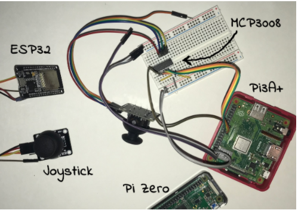
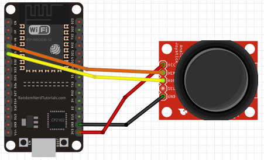
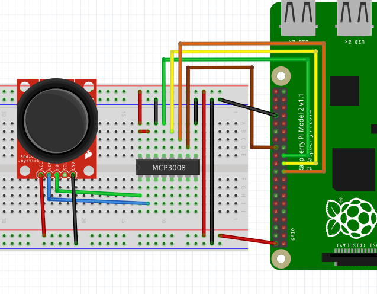
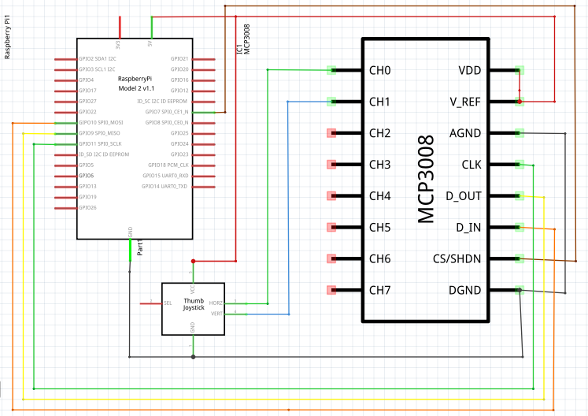
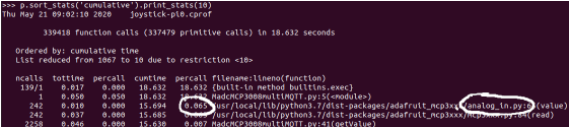
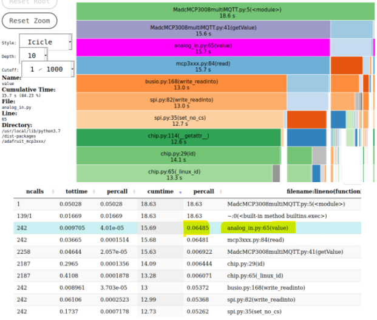

# Compare Performance of Analog Joystick with Raspberry Pi 3A+/0 (+MCP3008) vs ESP32

I was trying to use a Raspberry Pi0 (with MCP3008 ADC) to control a joystick for a motorized buggy. However, it was too laggy to be useable. After more testing I saw Raspberry Pi 3A+ (quad core) was better and ESP32 was best. By using cProfile on the Raspberry Pis and utime.ticks_diff() on ESP32 I could compare the amount of time each hardware took to get the analog input from the joystick and quantify what I was seeing with the buggy. It is easy to research how a microcontroller (ESP32) would be faster than a Raspberry Pi/ADC combo in an analog use case. But I wanted to be able to quantify the difference I was seeing between hardware. Boxplots are a great way to visualize how significant the delta is so the project gave me an opportunity to use Jupyter Notebook and learn how to create boxplots with Panda/Seaborn.  

First, to create the dataset, I would need to isolate the bottle neck in the program.  cProfile would be used for the Raspberry Pi Python programs and utime.ticks_diff() would be used to investigate the ESP32 micropython code.​​​

## Connections and Hardware
To install Adafruit packages for MCP3008   
`(.venv)$ python3 -m pip install adafruit-circuitpython-mcp3xxx`

## Using cProfile to analyze python code
For the Raspberry Pi0 and Pi3A+, cProfile was used to track down what portion of code was taking the longest. cProfile should be in standard Python library and no need to be installed. Execute the program with cProfile (syntax below) and move the joystick allowing the profiler to collect data on how long each function is taking.​  
`(.venv)$ python3 -m cProfile -o outputfilename.cprof script-name.py`
for example  
`(.venv)$ python3 -m cProfile -o profile-data.cprof buggy.py`  

* See adcRPi-MCP3008.py for code 

Once you have a time profile file created there are a couple options to view the results.
1. pstats (output in python REPL)
2. snakeviz (visual in web browser)

## pstats
A quick table output can be seen with pstats.  
`(.venv)$ python3 -m pip install pstats-view`

Then go into Python REPL   
`>>> import pstats`  
`>>> p = pstats.Stats('outputfilename.cprof')`  
`>>> p.sort_stats('cumulative').print_stats(10)`

## SnakeViz
Visual chart of the data viewable in a web browser.  

`(.venv)$ python3 -m pip3 install snakeviz `  
`(.venv)$ snakeviz outputfilename.cprof `  
`(.venv)$ snakeviz --help`

Again you can see the analog_in.py taking up most of the program time for the RPi0 when considering time per call and number of calls.  Similar analysis was done for the RPi3A+.

## Using utime.ticks_diff(time1, time2) to analyze upython code on ESP32

To get the ESP32 time required to collect the analog data utime.ticks_diff() was used.  The setup is fairly simple.  You put time0 (starting time) before the section to analyze and then use the utime.ticks_diff(currenttime, time0) to calculate the delta.  (time to read can be recorded to a txt file or sent to a server via MQTT and saved in a database.   Example below includes output to a txt file. The time is output in us so divide by 1000 to get ms.​​

* See upython-ESP32/main.py code

## Final Comparison

Pandas and Seaborn were used to create boxplots comparing the data (note a different set of data was collected with more samples for the final comparison)
See the jupyter notebook ADC-comparison.ipynb for Pandas/Seaborn instuctions.

cProfile and utime.ticks_diff() were helpful in isolating the slowest portion of the code and give insight why one hardware was performing better. cProfile for the Python code on Raspberry Pis and utime.ticks_diff() for upython on the ESP32. 

By analyzing the results you could see why a microcontroller like the ESP32 can sometimes be a better option for an analog application where you're reading a variable voltage. (the joystick reads the movement and outputs it as a voltage). And as noticed with the choppy buggy movement the Pi0 takes the longest, >50ms, to process/read the joystick thru the MCP3008. The ESP32 collects the joystick response the fastest at <1ms. The Pi3A+ was close but still slower than the ESP32 at 2.8ms.
